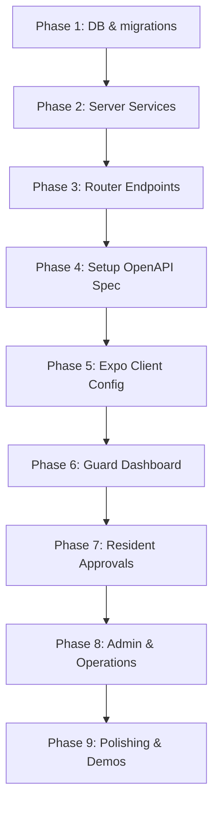

# Implementation Plan - Portl Society Management App (Detailed Version)

This document provides the complete technical specification and execution roadmap for building **Portl**, a mobile-first society management application.

---

## 1. User Roles & Architecture Design

Portl will use Better Auth's **Organization** plugin to model societies. Each society (e.g., "Green Glen Apartments") is an `Organization`. A user is mapped to a society via the `Member` model, and their role is defined by the `Member.role` property.

The application supports three roles:
1. **Resident (`role: "resident"`)**:
   - Approves/rejects gate entries.
   - Pre-approves guests (generates a 6-digit passcode).
   - Views notices, votes on community polls, books amenities, and logs complaints.
   - Views personal visitor history.
2. **Security Guard (`role: "guard"`)**:
   - Registers new visitors at the gate and requests approval.
   - Verifies pre-approved guest codes.
   - Marks visitor entry and exit.
   - Monitors active logs of who is inside the society.
3. **Society Admin (`role: "admin"`)**:
   - Manages society setup: Towers, Flats, Residents, Guards, and Amenities.
   - Posts official notices and community polls.
   - Views and updates the status of resident complaints.

---

## 2. Database Schema Configuration (`packages/db`)

### A. Modifications to [auth.prisma](file:///d:/portl/packages/db/prisma/schema/auth.prisma)
Add back-reference relations to the existing `User` and `Organization` models:

```prisma
model User {
  id                 String           @id
  name               String
  email              String
  emailVerified      Boolean          @default(false)
  image              String?
  createdAt          DateTime         @default(now())
  updatedAt          DateTime         @updatedAt
  sessions           Session[]
  accounts           Account[]
  members            Member[]
  invitations        Invitation[]     @relation("inviterInvitations")
  
  // Portl Society App Relations
  flats              Flat[]           // Flats the user resides in
  bookings           AmenityBooking[] // Amenity reservations made by this user
  authoredNotices    Notice[]         // Notices posted if user is admin
  votes              PollVote[]       // Votes cast by user
  complaints         Complaint[]      // Complaints raised by user
  registeredVisitors Visitor[]        // Visitors registered by this user (if guard)
  pushTokens         PushToken[]      // Mobile device push tokens
  notifications      Notification[]   // In-app notifications list
  
  @@unique([email])
  @@map("user")
}

model Organization {
  id             String          @id
  name           String
  slug           String
  logo           String?
  metadata       String?
  createdAt      DateTime        @default(now())
  members        Member[]
  invitations    Invitation[]
  
  // Portl Society App Relations
  towers         Tower[]
  amenities      Amenity[]
  notices        Notice[]
  polls          Poll[]
  complaints     Complaint[]
  visitors       Visitor[]
  staffProviders StaffProvider[]
  
  @@unique([slug])
  @@map("organization")
}
```

### B. [NEW] [society.prisma](file:///d:/portl/packages/db/prisma/schema/society.prisma)
Create a new schema file defining the core business tables:

```prisma
model Tower {
  id             String       @id @default(uuid())
  name           String       // e.g., "Tower A", "Tower B"
  organizationId String
  organization   Organization @relation(fields: [organizationId], references: [id], onDelete: Cascade)
  flats          Flat[]
  createdAt      DateTime     @default(now())
  updatedAt      DateTime     @updatedAt

  @@index([organizationId])
  @@map("tower")
}

model Flat {
  id        String    @id @default(uuid())
  number    String    // e.g., "101", "202-B"
  towerId   String
  tower     Tower     @relation(fields: [towerId], references: [id], onDelete: Cascade)
  residents User[]    // Implicit many-to-many join
  complaints Complaint[]
  visitors  Visitor[]
  createdAt DateTime  @default(now())
  updatedAt DateTime  @updatedAt

  @@index([towerId])
  @@map("flat")
}

model Amenity {
  id             String           @id @default(uuid())
  name           String           // e.g., "Clubhouse", "Gym", "Tennis Court"
  description    String?
  location       String?
  capacity       Int?
  organizationId String
  organization   Organization     @relation(fields: [organizationId], references: [id], onDelete: Cascade)
  bookings       AmenityBooking[]
  createdAt      DateTime         @default(now())
  updatedAt      DateTime         @updatedAt

  @@index([organizationId])
  @@map("amenity")
}

model AmenityBooking {
  id         String   @id @default(uuid())
  amenityId  String
  amenity    Amenity  @relation(fields: [amenityId], references: [id], onDelete: Cascade)
  bookedById String
  bookedBy   User     @relation(fields: [bookedById], references: [id], onDelete: Cascade)
  date       DateTime
  timeslot   String   // e.g., "09:00 AM - 11:00 AM", "04:00 PM - 06:00 PM"
  status     String   @default("CONFIRMED") // CONFIRMED, CANCELLED
  createdAt  DateTime @default(now())
  updatedAt  DateTime @updatedAt

  @@index([amenityId])
  @@index([bookedById])
  @@map("amenity_booking")
}

model Notice {
  id             String       @id @default(uuid())
  title          String
  content        String
  authorId       String
  author         User         @relation(fields: [authorId], references: [id], onDelete: Cascade)
  organizationId String
  organization   Organization @relation(fields: [organizationId], references: [id], onDelete: Cascade)
  createdAt      DateTime     @default(now())
  updatedAt      DateTime     @updatedAt

  @@index([organizationId])
  @@index([authorId])
  @@map("notice")
}

model Poll {
  id             String       @id @default(uuid())
  question       String
  options        String[]     // e.g., ["Yes", "No", "Undecided"]
  organizationId String
  organization   Organization @relation(fields: [organizationId], references: [id], onDelete: Cascade)
  votes          PollVote[]
  createdAt      DateTime     @default(now())
  updatedAt      DateTime     @updatedAt

  @@index([organizationId])
  @@map("poll")
}

model PollVote {
  id          String   @id @default(uuid())
  pollId      String
  poll        Poll     @relation(fields: [pollId], references: [id], onDelete: Cascade)
  userId      String
  user        User     @relation(fields: [userId], references: [id], onDelete: Cascade)
  optionIndex Int
  createdAt   DateTime @default(now())

  @@unique([pollId, userId])
  @@index([pollId])
  @@index([userId])
  @@map("poll_vote")
}

model Complaint {
  id             String       @id @default(uuid())
  title          String
  description    String
  category       String       // e.g., "PLUMBING", "ELECTRICAL", "SECURITY", "CLEANLINESS"
  status         String       @default("PENDING") // PENDING, IN_PROGRESS, RESOLVED
  raisedById     String
  raisedBy       User         @relation(fields: [raisedById], references: [id], onDelete: Cascade)
  flatId         String?
  flat           Flat?        @relation(fields: [flatId], references: [id], onDelete: SetNull)
  organizationId String
  organization   Organization @relation(fields: [organizationId], references: [id], onDelete: Cascade)
  createdAt      DateTime     @default(now())
  updatedAt      DateTime     @updatedAt

  @@index([organizationId])
  @@index([raisedById])
  @@map("complaint")
}

enum VisitorType {
  GUEST
  DELIVERY
  CAB
  STAFF
}

enum VisitorStatus {
  PENDING
  APPROVED
  REJECTED
  EXITED
}

model Visitor {
  id              String        @id @default(uuid())
  name            String
  phone           String
  purpose         String?
  type            VisitorType
  status          VisitorStatus @default(PENDING)
  preApprovedCode String?       // 6-digit code for pre-approved guests
  flatId          String
  flat            Flat          @relation(fields: [flatId], references: [id], onDelete: Cascade)
  enteredAt       DateTime?
  exitedAt        DateTime?
  registeredById  String        // Guard ID
  registeredBy    User          @relation(fields: [registeredById], references: [id], onDelete: Cascade)
  organizationId  String
  organization    Organization  @relation(fields: [organizationId], references: [id], onDelete: Cascade)
  createdAt       DateTime      @default(now())
  updatedAt       DateTime      @updatedAt

  @@index([organizationId])
  @@index([flatId])
  @@index([registeredById])
  @@map("visitor")
}

model StaffProvider {
  id             String       @id @default(uuid())
  name           String
  phone          String
  role           String       // e.g., "MAID", "DRIVER", "PLUMBER", "COOK"
  status         String       @default("ACTIVE") // ACTIVE, INACTIVE
  code           String?      // Optional card/badge ID
  organizationId String
  organization   Organization @relation(fields: [organizationId], references: [id], onDelete: Cascade)
  createdAt      DateTime     @default(now())
  updatedAt      DateTime     @updatedAt

  @@index([organizationId])
  @@map("staff_provider")
}

model PushToken {
  id        String   @id @default(uuid())
  token     String   @unique
  userId    String
  user      User     @relation(fields: [userId], references: [id], onDelete: Cascade)
  createdAt DateTime @default(now())
  updatedAt DateTime @updatedAt

  @@index([userId])
  @@map("push_token")
}

model Notification {
  id        String   @id @default(uuid())
  userId    String
  user      User     @relation(fields: [userId], references: [id], onDelete: Cascade)
  title     String
  body      String
  type      String   // e.g., "GATE_CALL", "NOTICE", "COMPLAINT", "AMENITY"
  data      String?  // JSON metadata (e.g., visitorId, complaintId)
  read      Boolean  @default(false)
  createdAt DateTime @default(now())

  @@index([userId])
  @@map("notification")
}
```

---

## 3. Backend REST API Architecture (`apps/server`)

API routes will be protected by validating session tokens and organization access. A helper middleware will resolve the member's role and society context from the session headers.

### A. Middlewares (`apps/server/src/middleware/auth.ts`)
- **`authMiddleware`**: Extracts user session via Better Auth.
- **`roleMiddleware(allowedRoles: string[])`**: Ensures the user belongs to the active organization and has one of the allowed membership roles (`admin`, `guard`, `resident`).

```typescript
export function resolveSocietyContext() {
  return async (c: Context, next: Next) => {
    const session = await auth.api.getSession({ headers: c.req.raw.headers });
    if (!session) return c.json({ error: "Unauthorized", code: "UNAUTHORIZED" }, 401);
    
    // Resolve organization membership
    const activeOrgId = session.session.activeOrganizationId;
    if (!activeOrgId) return c.json({ error: "No active society selected", code: "NO_ACTIVE_SOCIETY" }, 400);

    const member = await prisma.member.findFirst({
      where: { userId: session.user.id, organizationId: activeOrgId }
    });
    if (!member) return c.json({ error: "Forbidden", code: "FORBIDDEN" }, 403);

    c.set("session", session);
    c.set("societyId", activeOrgId);
    c.set("role", member.role);
    await next();
  };
}
```

### B. Endpoints Matrix

| Route Path | Method | Roles Allowed | Description |
| :--- | :---: | :---: | :--- |
| `/api/society/setup` | POST | `admin` | Set up initial Towers and Flats inside a society. |
| `/api/society/search-residents` | GET | `guard`, `admin` | Search residents by name, flat, or phone. |
| `/api/society/visitors` | POST | `guard` | Register a visitor at the gate (creates `PENDING` request). |
| `/api/society/visitors/verify-code` | POST | `guard` | Verify pre-approved guest codes and check-in. |
| `/api/society/visitors/:id/exit` | PATCH | `guard` | Mark visitor exit. |
| `/api/society/visitors/active` | GET | `guard`, `admin` | Retrieve all visitors currently inside the gates. |
| `/api/society/visitors/pending` | GET | `resident` | Fetch pending gate call notifications for the resident. |
| `/api/society/visitors/:id/respond` | PATCH | `resident` | Approve or reject entry request. |
| `/api/society/visitors/pre-approve` | POST | `resident` | Generate 6-digit code for guests. |
| `/api/society/notices` | GET | `resident`, `guard`, `admin` | View notice board logs. |
| `/api/society/notices` | POST | `admin` | Add notice. |
| `/api/society/polls` | GET | `resident`, `admin` | List active society polls with total vote counters. |
| `/api/society/polls/:id/vote` | POST | `resident` | Cast vote on poll option. |
| `/api/society/polls` | POST | `admin` | Create new community poll. |
| `/api/society/complaints` | GET | `resident`, `admin` | View complaints list. |
| `/api/society/complaints` | POST | `resident` | Raise a helpdesk complaint. |
| `/api/society/complaints/:id` | PATCH | `admin` | Update status of a ticket (`IN_PROGRESS`/`RESOLVED`). |
| `/api/society/amenities` | GET | `resident`, `admin` | List amenities and active bookings. |
| `/api/society/amenities/book` | POST | `resident` | Reserve amenity timeslot. |
| `/api/society/staff` | GET | `resident`, `guard`, `admin` | View society staff/service provider directory. |
| `/api/notifications/register-token` | POST | `resident`, `guard`, `admin` | Register an Expo Push Token for the logged-in user. |
| `/api/notifications` | GET | `resident`, `guard`, `admin` | Get in-app notification log history. |
| `/api/notifications/:id/read` | PATCH | `resident`, `guard`, `admin` | Mark notification as read. |

### C. Push Notification Dispatch Service (Backend Helper)
When database triggers occur (e.g. guard requests visitor entry, admin posts notice), the server will create an in-app `Notification` record and send a push dispatch:
```typescript
async function sendPushNotification(userId: string, title: string, body: string, data?: object) {
  // 1. Fetch user device tokens
  const tokens = await prisma.pushToken.findMany({ where: { userId } });
  if (!tokens.length) return;

  const messages = tokens.map(t => ({
    to: t.token,
    sound: 'default',
    title,
    body,
    data: data || {},
  }));

  // 2. Call Expo Push Service API
  try {
    await fetch('https://exp.host/--/api/v2/push/send', {
      method: 'POST',
      headers: {
        'Accept': 'application/json',
        'Accept-encoding': 'gzip, deflate',
        'Content-Type': 'application/json',
      },
      body: JSON.stringify(messages),
    });
  } catch (error) {
    console.error('Failed to send push notifications:', error);
  }
}
```

---

## 4. Frontend Mobile App Layouts (`apps/native`)

We will use **Expo Router** and style screens using **Tailwind CSS v4 (via Uniwind)** with **HeroUI Native** controls.

### A. Screen Hierarchy
```
apps/native/app/
├── (auth)/
│   ├── sign-in.tsx           # Email/Password Login
│   └── sign-up.tsx           # Account registration
├── (drawer)/
│   ├── index.tsx             # Redirects to correct dashboard based on role
│   ├── _layout.tsx           # Main Drawer setup
│   ├── resident/
│   │   ├── dashboard.tsx     # Notice board, pending gate calls, voting polls
│   │   ├── book-amenity.tsx  # Interactive amenity scheduler
│   │   ├── helpdesk.tsx      # Complaints tracker & ticket creation form
│   │   ├── pre-approve.tsx   # Guest code generation screen
│   │   ├── directory.tsx     # Staff contacts list
│   │   └── notifications.tsx # List of all resident notifications (Notice alerts, gate requests, amenities, etc.)
│   ├── guard/
│   │   ├── dashboard.tsx     # Flat lookup & visitor registration form
│   │   ├── check-passcode.tsx # Quick-verify screen for guest codes
│   │   └── visitor-logs.tsx  # List of visitors inside + "Mark Exit" action
│   └── admin/
│       ├── dashboard.tsx     # Towers, flats, and guards manager dashboard
│       ├── manage-tickets.tsx # List of complaints with resolve sliders
│       ├── create-notice.tsx # Write notices
│       └── create-poll.tsx   # Add poll forms
```

### B. High-Fidelity Style System
Following our UI/UX guide:
- **Primary Surface**: `bg-zinc-950` / `#09090b` for deep premium dark mode.
- **Card Backgrounds**: `bg-zinc-900 border border-zinc-800 rounded-2xl`
- **Accent highlights**: Amber/Gold tones for CTA and action highlights (`bg-amber-600 active:bg-amber-500 border-amber-800 text-amber-50`).
- **Rounded Edges**: Continuous borders (`borderCurve: 'continuous'` or `rounded-2xl` for modern iOS styling).
- **Icons**: Lucide icons or SF Symbols (via `expo-image` where applicable).

### C. Notification Deep Linking Integration
We will configure `expo-notifications` at the root layout of our app to capture incoming push notifications and handle redirection using Expo Router.

```typescript
// apps/native/app/_layout.tsx (Integrated Global Hook)
import { useEffect } from "react";
import * as Notifications from "expo-notifications";
import { router } from "expo-router";

function useNotificationObserver() {
  useEffect(() => {
    function redirect(notification: Notifications.Notification) {
      const url = notification.request.content.data?.url;
      if (typeof url === "string") {
        router.push(url);
      }
    }

    // Check if the app was launched by clicking a notification
    const response = Notifications.getLastNotificationResponse();
    if (response?.notification) {
      redirect(response.notification);
    }

    // Subscribe to notification click events while the app is running
    const subscription = Notifications.addNotificationResponseReceivedListener(response => {
      redirect(response.notification);
    });

    return () => {
      subscription.remove();
    };
  }, []);
}
```
When a resident receives a visitor request, they get a push notification payload like:
```json
{
  "to": "ExponentPushToken[xxx]",
  "title": "Gate Call - Visitor Alert",
  "body": "Delivery Partner John Doe requests entry for Flat 101.",
  "data": {
    "url": "/resident/dashboard?activeVisitorId=123"
  }
}
```
Tapping this notification automatically redirects them to the resident dashboard with the visitor approval modal pre-opened.


---

## 5. State Management & API Hooks

### A. Queries (`apps/native/queries/*.ts`)
We will create structured hook modules for server state:
- **`useVisitorQueries`**:
  - `usePendingGateCalls()`: Short-polls every 5-10 seconds on the Resident screen to detect visitor calls.
  - `useRegisterVisitorMutation()`: Mutates state when guard registers entry.
  - `useRespondVisitorMutation()`: Resident approves or denies the visitor.
- **`useAmenityQueries`**:
  - `useAmenities()`: Fetches list of amenities.
  - `useBookAmenity()`: Mutates booking records.
- **`useNoticeQueries`**:
  - `useNotices()`: Fetches society notices.
- **`useComplaintQueries`**:
  - `useComplaints()`: Fetches list of tickets.
  - `useRaiseComplaint()`: Submits new ticket.
- **`useNotificationQueries`**:
  - `useNotifications()`: Fetches history log.
  - `useRegisterPushToken()`: Registers Expo push token.
  - `useMarkNotificationRead()`: Marks notification status read.

### B. Stores (`apps/native/store/*.ts`)
Zustand will handle local UI state:
- **`useAuthStore`**: Tracks active role, profile, and selected organization.
- **`useFilterStore`**: Tracks active search inputs and filter categories in lookup registries and logs.

---

## 6. Implementation Roadmap



### Execution Details:
* **Phase 1: Database Setup**: Generate Prisma schema additions. Apply migrations using `bun db:push`. Run `bun db:generate` to output Prisma types.
* **Phase 2: Services & Logic**: Build DB queries for society models in `apps/server/src/services/`.
* **Phase 3: Routes & Controllers**: Mount handlers on Hono. Add Zod schemas to validate incoming payloads. Ensure CORS allows links.
* **Phase 4: API Playground**: Document all routes inside `apps/server/src/docs/openapi.ts` to allow interactive checks via `/reference`.
* **Phase 5: Mobile Shell**: Establish paths in `apps/native/app/`. Setup theme variables and base provider wrapper files.
* **Phase 6: Gate Ops Flow**: Code Flat search queries. Implement Guard register screens. Implement active entry logs list with exited status updates.
* **Phase 7: Resident Approvals Flow**: Write gate call card list. Short-poll for `PENDING` states. Implement passcode pre-approval generator.
* **Phase 8: Amenities & Community Management**: Add bookings calendars, notices lists, interactive polls, and complaints logs.
* **Phase 9: Polish & Demo Seeds**: Seed database with mock flats, towers, residents, and active notices. Add a "Simulate Call" triggers screen inside developer views to showcase real-time guard-to-resident notifications.

---

## 7. Verification & Testing Plan

### Automated Checks
* Validate types: `bun run check-types`
* Verify compiler builds: `bun run build`

### Manual Verification Flows
1. **Resident Gate Call Flow**:
   - Guard signs in, searches for "Tower A, Flat 101".
   - Guard registers visitor "John Doe (Delivery)" at the gate.
   - Resident signs in, sees John Doe pending entry pop-up card.
   - Resident taps **Approve**.
   - Guard list updates, showing John Doe checked-in.
   - Guard taps **Mark Exit** when delivery is complete.
2. **Pre-approved Passcode Flow**:
   - Resident registers Guest, gets pass code `589410`.
   - Guard inputs code `589410` on passcode verify screen.
   - Code successfully validates and logs check-in.
3. **Amenity Reservation Flow**:
   - Resident logs booking request for "Tennis Court" at 4:00 PM.
   - Re-check list: verify the 4:00 PM timeslot card is greyed-out for other residents.
4. **Admins Panel Flow**:
   - Admin logs in, updates notice boards, creates a new poll, and modifies a complaint state. Verify changes reactively update in resident lists.

---

## 8. EAS Project & Expo Dashboard Setup Guide

To obtain push notification tokens (`ExponentPushToken[...]`), the app must be registered with EAS (Expo Application Services) and configured with FCM/APNs credentials.

### Step 1: Initialize EAS Project via CLI
1. Ensure the global EAS CLI is installed:
   ```bash
   npm install -g eas-cli
   ```
2. Log in to your Expo account:
   ```bash
   eas login
   ```
3. Navigate to the mobile app directory (`apps/native`) and run the initialization command:
   ```bash
   eas project:init
   ```
   * *This will prompt you to log in (if not already logged in), select or create a new project named `portl`, and automatically generate/inject the unique `"projectId"` configuration under `expo.extra.eas.projectId` inside `app.json`.*

### Step 2: Configure Environment Variables
Copy the generated `"projectId"` from `app.json` and paste it inside `apps/native/.env`:
```env
EXPO_PUBLIC_EAS_PROJECT_ID=your-eas-project-id
```

### Step 3: Link Push Credentials in Expo Dashboard
To enable remote push notifications, FCM (Android) and APNs (iOS) credentials must be linked to your Expo project in the Expo Dashboard.

#### A. Android Setup (Firebase Cloud Messaging - FCM)
1. Go to the [Google Firebase Console](https://console.firebase.google.com/) and create a project.
2. Go to **Project Settings** (gear icon) -> **Service accounts**.
3. Under the **Firebase Admin SDK** section, click **Generate new private key**. This downloads a private key `.json` file containing your credentials.
4. Go to the [Expo Dashboard](https://expo.dev/), select your `portl` project.
5. In the left navigation, click **Project Settings** -> **Credentials**.
6. Select **Android** -> **Service Account Key** and upload the Firebase `.json` file you generated.

#### B. iOS Setup (Apple Push Notification service - APNs)
1. Go to the [Apple Developer Portal](https://developer.apple.com/account/).
2. Select **Certificates, Identifiers & Profiles** -> **Keys** -> Click **+** (create key).
3. Enable **Apple Push Notifications service (APNs)**. Register and download the generated `.p8` file. Note the **Key ID** and your **Apple Team ID**.
4. Go to the [Expo Dashboard](https://expo.dev/), select your `portl` project.
5. Click **Project Settings** -> **Credentials** -> **iOS**.
6. Under APNs Configuration, click **Add Key** and upload your `.p8` file, enter the **Key ID**, and **Apple Team ID**.

### Step 4: Build / Run Development Environment
* *Note: Remote push notifications are only supported on physical devices or Android Emulators with Google Play Services. For Android in SDK 53+, a custom development build is required to receive push notifications. Local in-app banner alerts will work during emulator/simulator testing.*

