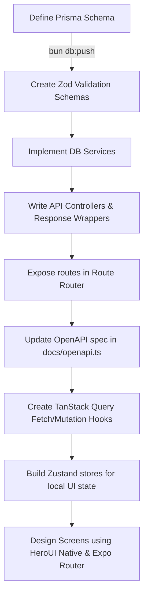

# portl

This file provides context about the project for AI assistants.

## Project Overview

- **Ecosystem**: React-native

## Tech Stack

## Project Structure

## Common Commands

## Maintenance

Keep AGENTS.md updated when:

- Adding/removing dependencies
- Changing project structure
- Adding new features or services
- Modifying build/dev workflows

AI assistants should suggest updates to this file when they notice relevant changes.


## 1. Monorepo & Directory Structure

This project is managed and scaffolded using a monorepo structure:

```
<workspace-root>/
├── apps/
│   ├── native/               # Mobile App (Expo + React Native + Tailwind v4 via Uniwind)
│   └── server/               # Backend API Server (Hono + Bun)
├── packages/
│   ├── auth/                 # Better Auth core instance & configuration
│   ├── db/                   # Prisma client, schema, and database connections
│   ├── env/                  # Zod-validated environment configurations (native/server)
│   └── config/               # Shared TypeScript and bundler configurations
```

---

## 2. Backend Architecture (Hono + Prisma + Zod)

The backend follows a strict **Route -> Controller -> Service -> Schema** pattern. This keeps Hono endpoints clean, separates HTTP concerns from business logic, and maintains database abstractions.

### A. Routes (`/routes/*.routes.ts`)
Routes define the HTTP endpoints, bind request-scoped middlewares (such as auth/roles), and delegate handler execution directly to the controller class.

```typescript
// apps/server/src/routes/vehicle.routes.ts
import { Hono } from "hono";
import { VehicleController } from "../controllers/vehicle.controller";
import { roleMiddleware } from "../middleware/auth";

const router = new Hono();

router.get("/", VehicleController.getVehicles);
router.post("/", roleMiddleware(["FLEET_MANAGER"]), VehicleController.createVehicle);
router.patch("/:id", roleMiddleware(["FLEET_MANAGER"]), VehicleController.updateVehicle);

export default router;
```

### B. Controllers (`/controllers/*.controller.ts`)
Controllers handle HTTP-specific logic. They parse request parameters, validate incoming bodies using Zod schemas, handle exceptions, and return structured JSON payloads using the helper response wrappers.

```typescript
// apps/server/src/controllers/vehicle.controller.ts
import type { Context } from "hono";
import { VehicleService } from "../services/vehicle.service";
import { successResponse, errorResponse } from "../lib/api-response";
import { createVehicleSchema } from "../schemas/vehicle.schema";

export class VehicleController {
  static async createVehicle(c: Context) {
    try {
      const body = await c.req.json();
      const parsed = createVehicleSchema.safeParse(body);
      
      if (!parsed.success) {
        return errorResponse(c, "Invalid request payload", "VALIDATION_ERROR", 400, parsed.error.format());
      }

      // Business check
      const existing = await VehicleService.getVehicleByRegNumber(parsed.data.registrationNumber);
      if (existing) {
        return errorResponse(c, "Vehicle already exists", "CONFLICT_ERROR", 409);
      }

      const vehicle = await VehicleService.createVehicle(parsed.data);
      return successResponse(c, vehicle, 201);
    } catch (err: any) {
      return errorResponse(c, err.message, "INTERNAL_ERROR", 500);
    }
  }
}
```

### C. Services (`/services/*.service.ts`)
Services run database operations and core business rules. They import the shared Prisma instance and never interact directly with Hono's `Context` or return HTTP status codes.

```typescript
// apps/server/src/services/vehicle.service.ts
import prisma from "@workspace/db";

export class VehicleService {
  static async getVehicleByRegNumber(registrationNumber: string) {
    return await prisma.vehicle.findUnique({
      where: { registrationNumber },
    });
  }

  static async createVehicle(data: {
    registrationNumber: string;
    name: string;
    type: string;
    maxLoadCapacity: number;
    odometer: number;
    acquisitionCost: number;
    region: string;
  }) {
    return await prisma.vehicle.create({
      data,
    });
  }
}
```

### D. Validation Schemas (`/schemas/*.schema.ts`)
Validation schemas define raw Zod shapes for input checking. They are reused in both backend controllers and frontend forms to maintain End-to-End type safety.

```typescript
// apps/server/src/schemas/vehicle.schema.ts
import { z } from "zod";

export const createVehicleSchema = z.object({
  registrationNumber: z.string().min(1, "Registration number is required"),
  name: z.string().min(1, "Name is required"),
  type: z.string().min(1, "Type is required"),
  maxLoadCapacity: z.number().positive("Capacity must be positive"),
  odometer: z.number().nonnegative(),
  acquisitionCost: z.number().positive(),
  region: z.string().min(1),
});
```

### E. API Documentation (Scalar + OpenAPI)
We document our API endpoints using the OpenAPI specification. The documentation is served interactively in development using the **Scalar** API Reference playground (`@scalar/hono-api-reference`).

#### 1. Serving the Spec & Interactive Playground (`apps/server/src/index.ts`)
The server exposes the raw JSON specification on `/openapi.json` and mounts the interactive Scalar reference UI on `/reference`:
```typescript
import { apiReference } from "@scalar/hono-api-reference";
import { openapiSpec } from "./docs/openapi";

// Serve raw OpenAPI JSON
app.get("/openapi.json", (c) => c.json(openapiSpec));

// Mount Scalar API Reference UI
app.get("/reference", apiReference({ spec: { url: "/openapi.json" } }));
```

#### 2. Writing the Specification (`apps/server/src/docs/openapi.ts`)
API documentation is maintained in a single structured OpenAPI object. The paths, request/response models, tag groups, and security options must match the actual router implementation:
```typescript
export const openapiSpec = {
  openapi: "3.0.0",
  info: {
    title: "TransitOps API Reference",
    version: "1.0.0",
    description: "Documentation for TransitOps Smart Transport Operations Platform APIs.",
  },
  servers: [
    {
      url: "http://localhost:3000",
      description: "Development Server",
    },
  ],
  tags: [
    { name: "Vehicles", description: "Operations and registry details for the fleet vehicle assets" },
  ],
  paths: {
    "/api/vehicles": {
      "get": {
        "tags": ["Vehicles"],
        "summary": "List Vehicles",
        "parameters": [
          { "name": "status", "in": "query", "schema": { "type": "string" } }
        ],
        "responses": {
          "200": {
            "description": "Success",
            "content": {
              "application/json": {
                "schema": {
                  "type": "object",
                  "properties": {
                    "success": { "type": "boolean" },
                    "data": { "type": "array", "items": { "$ref": "#/components/schemas/Vehicle" } }
                  }
                }
              }
            }
          }
        }
      }
    }
  },
  components: {
    schemas: {
      Vehicle: {
        "type": "object",
        "properties": {
          "id": { "type": "string" },
          "registrationNumber": { "type": "string" },
          "status": { "type": "string" }
        }
      }
    }
  }
};
```
Whenever endpoints, parameters, request body schemas, or response models are updated or added, developers must keep `openapiSpec` synchronized in `apps/server/src/docs/openapi.ts`.

#### 3. Best Practices for Scalar & OpenAPI
To keep the API documentation robust and highly useful, adhere to the following guidelines:
- **Synchronize Zod and OpenAPI Schemas**: When modifying validation schemas under `apps/server/src/schemas/`, verify that the corresponding schemas in `components.schemas` in `openapi.ts` are updated to match the payload shape and type constraints.
- **Explicit Role Requirements**: If an endpoint is guarded by a role middleware, state the required roles clearly in the endpoint's `description` field (e.g., `"Requires FLEET_MANAGER or SAFETY_OFFICER roles."`).
- **Document Common Errors**: Include standard error responses in the spec (e.g., `400` Validation Error, `401` Unauthorized, `403` Forbidden, `404` Not Found, `409` Conflict) so the frontend has accurate type definitions for handling server errors.
- **Strict Tagging**: Group related paths under defined tags (e.g. `"Vehicles"`, `"Drivers"`, `"Trips"`) to keep the Scalar playground sidebar organized.
- **Parameter Definitions**: Explicitly document all query parameters, path variables, and request body structures, including their types and enum limits, to enable seamless sandbox testing from the playground.

---

## 3. Authentication & RBAC (Better Auth)

We use **Better Auth** for secure, session-based credentials, with role-based access control (RBAC) configured end-to-end.

### A. Database Schema
Roles are defined as an enum in the database schema (`packages/db/prisma/schema/auth.prisma`) and mapped to the `User` model:
```prisma
enum Role {
  FLEET_MANAGER
  DISPATCHER
  SAFETY_OFFICER
  FINANCIAL_ANALYST
  DRIVER
}

model User {
  id    String @id
  email String @unique
  role  Role   @default(DISPATCHER)
  ...
}
```

### B. Better Auth Server Setup (`packages/auth/src/index.ts`)
The `role` field is registered as a custom user field so Better Auth knows how to parse and include it in the session object:
```typescript
export const auth = betterAuth({
  database: prismaAdapter(prisma, { provider: "postgresql" }),
  trustedOrigins: [env.CORS_ORIGIN],
  emailAndPassword: { enabled: true },
  user: {
    additionalFields: {
      role: {
        type: "string",
        defaultValue: "DISPATCHER",
      },
    },
  },
});
```

### C. Type-Safe Client Setup (`apps/native/lib/auth-client.ts`)
On the frontend, the client imports `auth` from the server package and configures the Expo client plugin:
```typescript
import { expoClient } from "@better-auth/expo/client";
import { env } from "@portl/env/native";
import { createAuthClient } from "better-auth/react";
import Constants from "expo-constants";
import * as SecureStore from "expo-secure-store";

export const authClient = createAuthClient({
  baseURL: env.EXPO_PUBLIC_SERVER_URL,
  plugins: [
    expoClient({
      scheme: Constants.expoConfig?.scheme as string,
      storagePrefix: Constants.expoConfig?.scheme as string,
      storage: SecureStore,
    }),
  ],
});
```

### D. Backend RBAC Middleware (`apps/server/src/middleware/auth.ts`)
The backend validates sessions via cookies (using `withCredentials: true` on Axios requests) and protects routes using the `roleMiddleware` factory:
```typescript
export const roleMiddleware = (allowedRoles: string[]) => {
  return async (c: Context, next: Next) => {
    const session = c.get("session") || await auth.api.getSession({ headers: c.req.raw.headers });
    if (!session) {
      return c.json({ error: "Unauthorized", code: "UNAUTHORIZED" }, 401);
    }
    
    if (!allowedRoles.includes(session.user.role)) {
      return c.json({ error: "Forbidden", code: "FORBIDDEN" }, 403);
    }
    
    c.set("session", session);
    await next();
  };
};
```

### E. Frontend Protection & Router Integration
Protected screens or layout routes check the active session (e.g. using hooks or redirect patterns):
```typescript
// apps/native/app/(drawer)/_layout.tsx
// Check session status using authClient.useSession() and conditionally render or redirect
const { data: session, isPending } = authClient.useSession();
if (!isPending && !session) {
  // Handle redirect/view state accordingly
}
```

---

## 4. Frontend Architecture (Expo Router + TanStack Query + Zustand)

We structure frontend code using Expo Router for navigation, TanStack Query for server state management, and Zustand for client UI state, styled using Tailwind CSS via Uniwind and components from `heroui-native`.

```
apps/native/
├── app/                      # Expo Router file-based routing
│   ├── (drawer)/             # Drawer-based main layout
│   │   ├── (tabs)/           # Tab-based sub-layout
│   │   └── index.tsx         # Drawer homepage
│   ├── _layout.tsx           # Root navigation layout provider
│   └── modal.tsx             # Interactive modal screen
├── components/               # Shared reusable components
├── contexts/                 # Context providers (e.g., Theme/App state)
├── queries/                  # TanStack Query custom hooks (API fetches & mutations)
├── store/                    # Zustand stores for local UI filters and states
└── lib/                      # Auth client, API configuration, and helpers
```

### A. Server State Hooks (`/queries/*.ts`)
All API calls are defined as reusable hooks returning standard queries or mutations. This ensures automatic caching, stale time management, and background updates.

```typescript
// apps/native/queries/vehicles.ts
import { useQuery, useMutation, useQueryClient } from "@tanstack/react-query";
import { api } from "../lib/api"; // Axios/Fetch client wrapper

export function useVehiclesQuery(filters?: { status?: string; type?: string; search?: string }) {
  return useQuery({
    queryKey: ["vehicles", filters],
    queryFn: async () => {
      const res = await api.get("/vehicles", { params: filters });
      return res.data.data;
    },
    staleTime: 1000 * 30, // 30 seconds cache freshness
  });
}
```

### B. Client State Stores (`/store/*.ts`)
Zustand is used for client-side UI configurations and active API request filters/parameters. Do not store heavy server payloads or API response arrays in Zustand stores.

```typescript
// apps/native/store/useDashboardStore.ts
import { create } from "zustand";

interface DashboardFilters {
  vehicleType: string;
  status: string;
  search: string;
  setVehicleType: (type: string) => void;
  setStatus: (status: string) => void;
  setSearch: (search: string) => void;
  resetFilters: () => void;
}

export const useDashboardStore = create<DashboardFilters>((set) => ({
  vehicleType: "All",
  status: "All",
  search: "",
  setVehicleType: (vehicleType) => set({ vehicleType }),
  setStatus: (status) => set({ status }),
  setSearch: (search) => set({ search }),
  resetFilters: () => set({ vehicleType: "All", status: "All", search: "" }),
}));
```

### C. Navigation & Contexts
Expo Router serves as our client-side navigation engine. Global settings and providers (e.g., themes, gesture handlers, and auth states) are wrap-configured in the root layout:

```typescript
// apps/native/app/_layout.tsx
export default function Layout() {
  return (
    <GestureHandlerRootView style={{ flex: 1 }}>
      <KeyboardProvider>
        <AppThemeProvider>
          <HeroUINativeProvider>
            <StackLayout />
          </HeroUINativeProvider>
        </AppThemeProvider>
      </KeyboardProvider>
    </GestureHandlerRootView>
  );
}
```

### D. Styling & Design System
We use Tailwind CSS v4 utility classes paired with `uniwind` to style React Native elements natively and responsively. Components are sourced or constructed using `heroui-native` surface and form inputs.


---

## 5. UI/UX Style Guide & Modern Aesthetics

Our interface features a high-fidelity, premium dark mode styling system. Default browser outputs are unacceptable.

### A. Theme and Colors
- **Main Backgrounds**: Dark mode default is a near-black, high-end zinc palette (e.g., `#09090b` or `bg-zinc-950`).
- **Accent Colors**: Warm, rich highlights such as amber (`bg-amber-700 hover:bg-amber-600 border-amber-800`), sky-blue, or gold. Avoid bright primary colors.
- **Typography**: Clean sans-serif using modern fonts (Inter or system sans).

### B. Clean Modern Layouts
Cards, dropdowns, and modals must use solid card surfaces, thin clean borders, and depth with drop shadows:
- **Card Styling**: `bg-white dark:bg-zinc-900 border border-zinc-200 dark:border-zinc-800 rounded-2xl p-6 shadow-sm`
- **Focus States**: Smooth transitions, clean/subtle rings like `focus-visible:ring-amber-700/50`.
- **Transitions**: Native Tailwind classes for smooth scale, fade, and hover animations.

---

## 6. End-to-End Development Workflow

When implementing any new business feature (e.g. adding a new "Shipment" module):



### Feature Implementation Checklist
1. **Database Update**: Write model schemas in `packages/db/prisma/schema.prisma` and run `bun db:push`.
2. **Input Schemas**: Define validation objects under `apps/server/src/schemas/`.
3. **Service Layer**: Write database operations class under `apps/server/src/services/`.
4. **Controller Layer**: Write routes handler class under `apps/server/src/controllers/`, verifying Zod inputs.
5. **Route Binding**: Mount paths under `apps/server/src/routes/` and export them.
6. **API Documentation**: Update the OpenAPI spec object in `apps/server/src/docs/openapi.ts` to document the new endpoints, tags, parameters, request body schemas, and response formats. Ensure it correctly displays on the `/reference` playground.
7. **Frontend Fetching**: Write custom Query/Mutation hooks under `apps/native/queries/`.
8. **Local UI State**: Add Zustand store if complex filters or state is required.
9. **Routing**: Create a new screen file in `apps/native/app/` (e.g. `apps/native/app/(drawer)/shipments.tsx`).
10. **UI Components**: Build beautiful layouts and inputs using tailwind v4 (via uniwind) and HeroUI Native.

---

## 7. Reference Implementations (Boilerplate Examples)

To prevent typescript compile collisions across the workspace, example files are presented below as inline code blocks.

### A. Complete Backend Flow

#### Zod Input Validation (`schemas/item.schema.ts`)
```typescript
import { z } from "zod";

export const createItemSchema = z.object({
  name: z.string().min(1, "Name is required"),
  description: z.string().optional(),
  quantity: z.number().int().positive("Quantity must be positive"),
  price: z.number().positive("Price must be positive"),
});

export const updateItemSchema = createItemSchema.partial();
```

#### Service DB Layer (`services/item.service.ts`)
```typescript
import prisma from "@workspace/db";
import type { z } from "zod";
import type { createItemSchema, updateItemSchema } from "../schemas/item.schema";

export class ItemService {
  static async getItems() {
    return await prisma.item.findMany({
      orderBy: { createdAt: "desc" },
    });
  }

  static async getItemById(id: string) {
    return await prisma.item.findUnique({
      where: { id },
    });
  }

  static async createItem(data: z.infer<typeof createItemSchema>) {
    return await prisma.item.create({
      data,
    });
  }

  static async updateItem(id: string, data: z.infer<typeof updateItemSchema>) {
    return await prisma.item.update({
      where: { id },
      data,
    });
  }
}
```

#### API Controller (`controllers/item.controller.ts`)
```typescript
import type { Context } from "hono";
import { ItemService } from "../services/item.service";
import { successResponse, errorResponse } from "../lib/api-response";
import { createItemSchema, updateItemSchema } from "../schemas/item.schema";

export class ItemController {
  static async getItems(c: Context) {
    try {
      const items = await ItemService.getItems();
      return successResponse(c, items);
    } catch (err: any) {
      return errorResponse(c, err.message, "DATABASE_ERROR", 500);
    }
  }

  static async createItem(c: Context) {
    try {
      const body = await c.req.json();
      const parsed = createItemSchema.safeParse(body);
      if (!parsed.success) {
        return errorResponse(c, "Validation failed", "VALIDATION_ERROR", 400, parsed.error.format());
      }
      const item = await ItemService.createItem(parsed.data);
      return successResponse(c, item, 201);
    } catch (err: any) {
      return errorResponse(c, err.message, "INTERNAL_ERROR", 500);
    }
  }
}
```

#### Route Registration (`routes/item.routes.ts`)
```typescript
import { Hono } from "hono";
import { ItemController } from "../controllers/item.controller";
import { authMiddleware, roleMiddleware } from "../middleware/auth";

const router = new Hono();

router.use("/*", authMiddleware);
router.get("/", ItemController.getItems);
router.post("/", roleMiddleware(["FLEET_MANAGER"]), ItemController.createItem);

export default router;
```

---

## 8. Code Quality & Standards (How to Write vs. How Not to Write)

To maintain a clean codebase, prevent memory leaks, and guarantee E2E type-safety, follow these strict coding practices:

### A. Backend Development

| Area | How to Write (Dos) | How NOT to Write (Don'ts) |
| :--- | :--- | :--- |
| **Prisma Instance** | Import the shared database client from the package:<br>`import prisma from "@workspace/db";` | Do **not** instantiate `new PrismaClient()` in individual files. Doing so causes database connection exhaustion. |
| **Hono Route Logic** | Delegate all data fetching and database operations to your Service layer class. Controllers should only parse HTTP inputs and call services. | Do **not** write raw Prisma queries directly in controllers, router files, or route middlewares. |
| **Hono Context** | Keep the Hono `Context` object restricted to routers, middlewares, and controllers. | Do **not** pass Hono `Context` or response-related variables (`c.json`, headers) down into service or helper layers. |
| **Type Safety** | Define clear Zod validation schemas for request bodies, query params, etc., and infer typescript types using `z.infer<typeof schema>`. | Do **not** use `any` or loose, untyped `Record<string, unknown>` objects for request input validation. |

### B. Frontend Development

| Area | How to Write (Dos) | How NOT to Write (Don'ts) |
| :--- | :--- | :--- |
| **Routing / Navigation** | Use Expo Router's file-based routing components (`Link`, `router.push`, etc.) for seamless navigation. | Do **not** use vanilla React Navigation methods that bypass Expo Router configurations. |
| **Styling** | Use Tailwind CSS utility classes (via `uniwind`) and `heroui-native` components for uniform dark-mode styling. | Do **not** use arbitrary inline stylesheets or hardcoded style objects that ignore the theme provider. |
| **Auth State** | Leverage `authClient.useSession()` hook to reactive-check authenticated session status in components. | Do **not** query `SecureStore` manually to check session tokens when user session context is already provided. |
| **Server State** | Use TanStack Query custom hooks (`useQuery` / `useMutation`) for retrieving and mutating database items. | Do **not** use `useEffect` coupled with manual `fetch` / `axios` calls inside UI components for server data. |
| **Local UI State** | Store client-side UI states and active API query filters (e.g. active search/type/region filters passed as query params) in a Zustand store. | Do **not** store heavy server payloads or API response arrays in Zustand stores. Let TanStack Query manage and cache server state. |

---

## 9. Additional Features (Email & Logging)

To keep application components robust and maintainable, use these patterns for secondary systems.

### A. Logging (Winston)
We use structured logging via **Winston** for debugging and telemetry. The logger formats messages cleanly based on target environments:
- **Development**: Colored human-readable logs with timestamps.
- **Production**: Structured JSON logs including error stack traces, request IDs, or metadata.

#### Usage Example:
```typescript
import { logger, createChildLogger } from "../lib/logger";

// Standard logging
logger.info("Server started successfully", { port: 3000 });
logger.warn("Suboptimal database response time detected");

// Error logging (passes the Error stack trace in metadata)
try {
  throw new Error("API Connection timeout");
} catch (err: any) {
  logger.error("Failed downstream API request", { error: err });
}

// Contextual child logger
const requestLogger = createChildLogger({ requestId: "req-123", userId: "usr-456" });
requestLogger.info("Retrieving driver list");
```

### B. Transactional Email (Resend)
We send emails using **Resend** and render them using **React Email** components.
- Configure the Resend client using the API key from environment variables (`RESEND_API_KEY`).
- Define templates as TSX functional components under the server or shared email folders.

#### Usage Example:
```typescript
import { Resend } from "resend";

const resend = new Resend(process.env.RESEND_API_KEY);

export async function sendOnboardingEmail(email: string, name: string) {
  return await resend.emails.send({
    from: "TransitOps <onboarding@resend.dev>",
    to: email,
    subject: "Welcome to TransitOps",
    html: `<p>Hello ${name}, your driver account has been created successfully!</p>`,
  });
}
```

